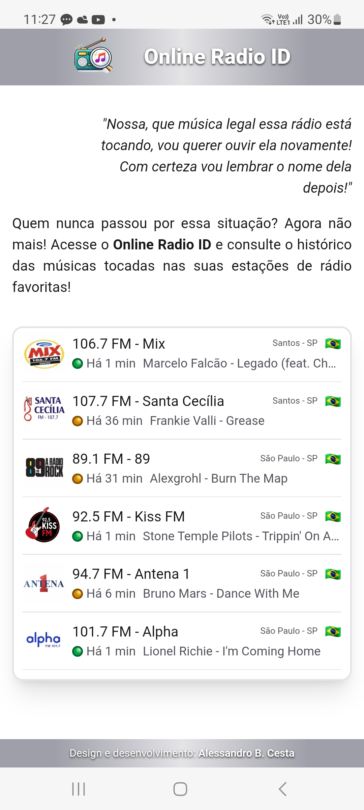
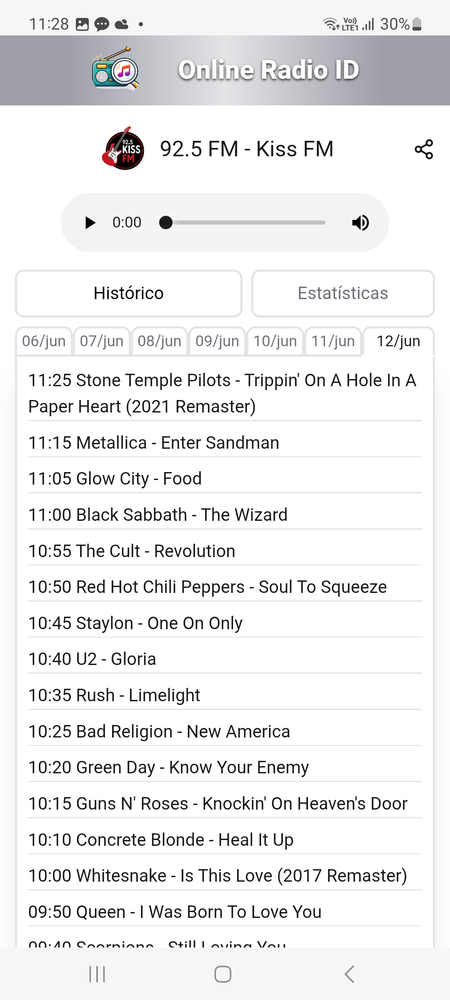
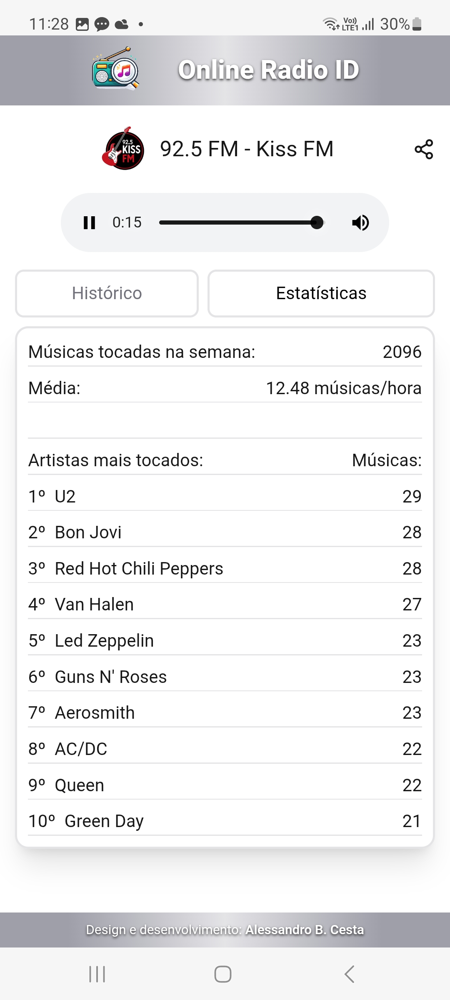
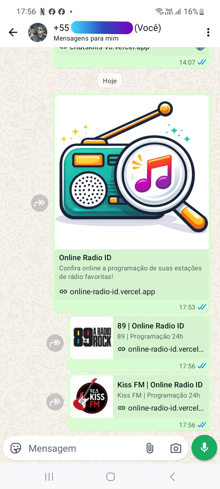
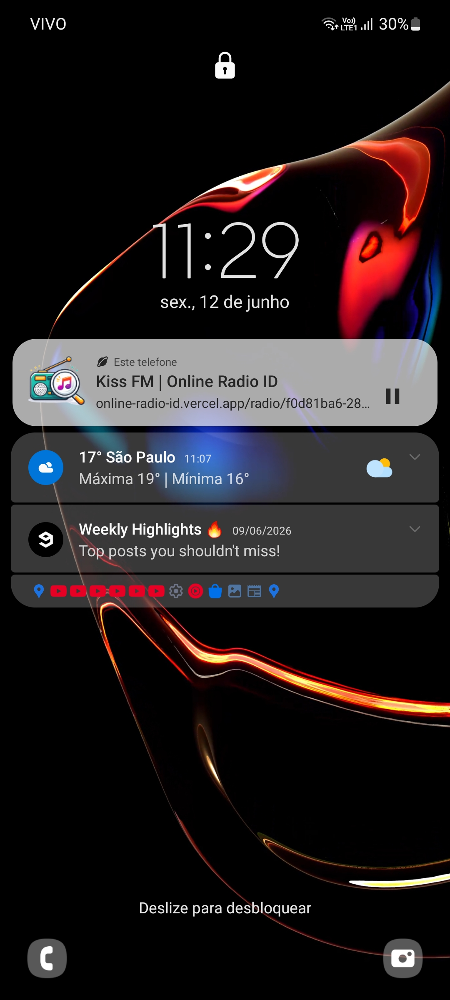

# online-radio-id

## 🚀 Projeto

Consulte quais músicas tocaram hoje nas suas estações de rádio favoritas!

Confira online em: [https://online-radio-id.vercel.app](https://online-radio-id.vercel.app)

## 🖼️ Screenshots

  
  
  

  
  

## 🧊 Cool features
- Reconhecimento das músicas por API própria ([radio-id API](https://github.com/Alessandro1918/radio-id), também desenvolvida por mim).
- Base de dados de rádios preferidas, com programação atualizada minuto a minuto.
- Exibição das músicas tocadas, classificadas por dia e hora.
- Estatísticas de cada rádio.
- Player de áudio da rádio em tempo real.
- Páginas compartilhadas por redes sociais, com metatags otimizadas para Whatsapp.
- Otimização: histórico de dias passados salvos em cache, e dados do dia atual requisitados em tempo real pela API.

## ⭐ Like, Subscribe, Follow!
Curtiu o projeto? Marque esse repositório com uma Estrela ⭐!
